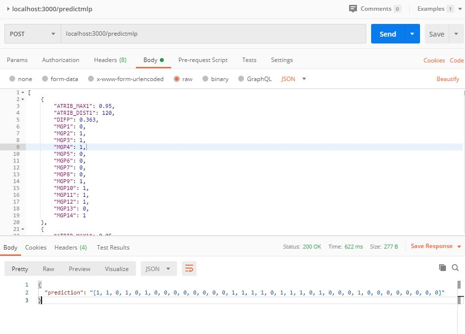

# mSc

> Repository for my MSC research in Machine Learning

> Machine Learning applied in E&P

> Data Science, Descriptive Statistics, E&P, Decision Support

<center><a href="http://dippg.cefet-rj.br/ppeel/index.php/component/content/article?id=97&Itemid=101">
</a></center>

## How to use

```
git clone https://github.com/giovanimachado/mSc.git
```

### Step 1 - Move to API Folder

```
cd API
```

### Step 2 - Start

```
python API.py
```

## API

### Predict Circulation Loss with MLP

```
POST localhost:3000/predictmlp
```

* Request body example

```json
{
        "ATRIB_MAX1": 0.95,
        "ATRIB_DIST1": 120,
        "DIFP": 0.363,
        "MGP1": 0,
        "MGP2": 1,
        "MGP3": 1,
        "MGP4": 1,
        "MGP5": 0,
        "MGP6": 0,
        "MGP7": 0,
        "MGP8": 0,
        "MGP9": 1,
        "MGP10": 1,
        "MGP11": 1,
        "MGP12": 1,
        "MGP13": 0,
        "MGP14": 1
}
```
* Request example Using Postman


